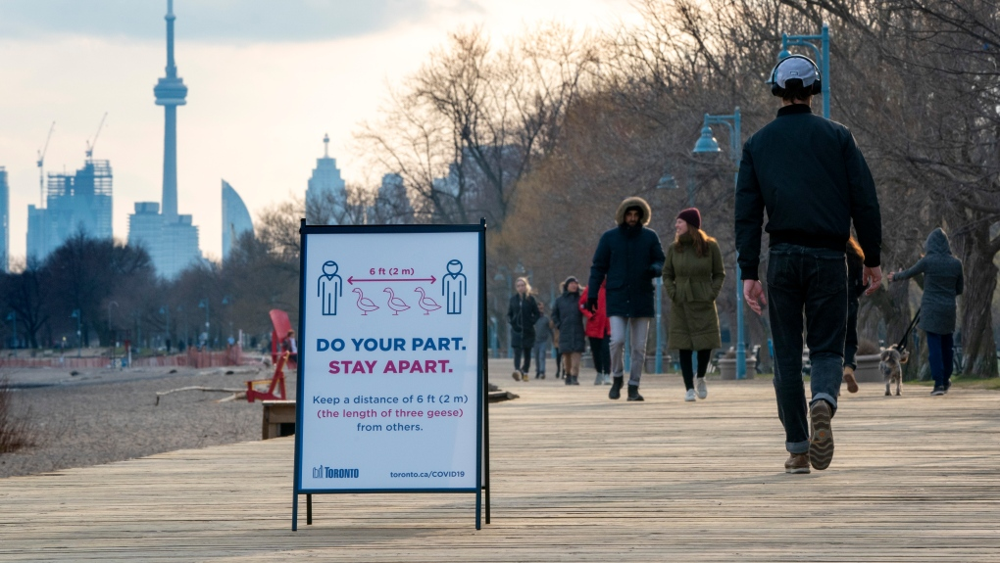



# COVID-19 in Toronto Interactive Web-app
This web-app converts this notebook(link), exploring COVID-19 rates and testing sites in Toronto, into an interactive web-app. 

This web-app uses data from the government of Canada database (publicly available [here](https://www.publichealthontario.ca/en/data-and-analysis/infectious-disease/covid-19-data-surveillance/covid-19-data-tool?tab=summary)).
Note: data is up to date until June 2021.

Contents
======
- [COVID-19 in Toronto Interactive Web-app](#covid-19-in-toronto-interactive-web-app)
- [Contents](#contents)
	- [Why?](#why)
	- [Tech Used](#tech-used)
	- [Installation](#installation)
	- [Features](#features)
		- [Choropleth Toggles](#choropleth-toggles)
		- [Marker Cluster Toggles](#marker-cluster-toggles)
	- [Want to Contribute?](#want-to-contribute)

## Why? 
The motivations for this web-app are:

-  making COVID-19 data more interactive, increasing user engagement
- informing individuals of the COVID-19 cases, and available testing sites in their local, and surrounding neighborhood(s)
- overall, help the public to make informative choices regarding COVID-19, contributing to the effort of decreasing the spread of COVID-19

## Tech Used

 - [Pandas](https://pandas.pydata.org/)
 - [GeoPandas](https://geopandas.org/)
 - [Folium](https://python-visualization.github.io/folium/)
 - [StreamLit](https://streamlit.io/)

## Installation 
1.  Clone the repo `$ git clone https://github.com/JP-sDEV/covid19_webapp.git`

2. `cd` into the root of the project
3. Create a virtual environment `python3 -m venv /path/to/new/virtual/environment`
	- [Virtual environments in Python](https://docs.python.org/3/library/venv.html)
4. Install with [`pip3`](https://pypi.org/project/shallow-backup/)
    - `$ pip3 install requirements.txt`

5. Run app locally with `streamlit run main.py`

## Features

### Choropleth Toggles
- toggle between different choropleth color schemes
  - Orange-Red
  - Blue-Purple
  - Purple-Red
  - Yellow-Brown

### Marker Cluster Toggles
- toggle the COVID-19 testing sites in Toronto
- adjust the radius of testing sites
  - decide whether or not a testing site is within walking/driving distance

## Want to Contribute?
1. Clone the repo by following [Installation](##Installation)
2. Improve the web-app by:
	- add a feature
	- resolving an issue in the [Issues](https://github.com/JP-sDEV/covid19_webapp/issues) tab
	- refactor code
3. Test the new feature locally
4. Update the Features section in the README.md
5. Open a pull request with a detailed explanation of the changes
